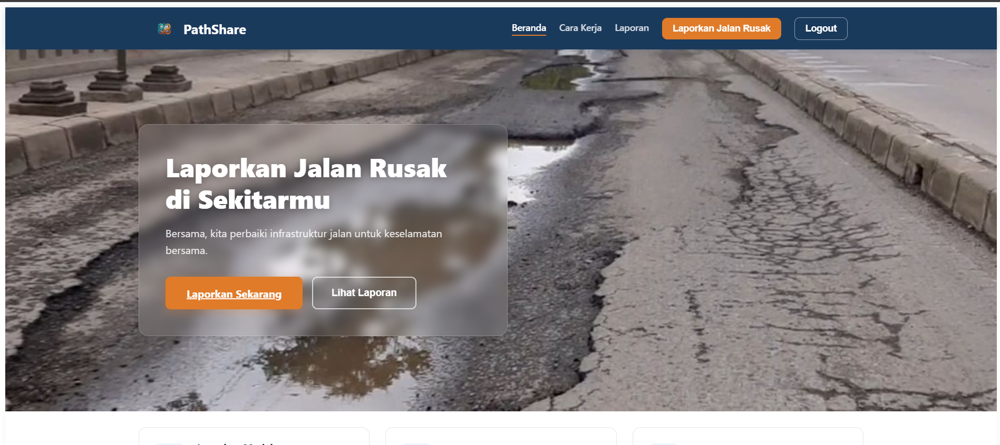
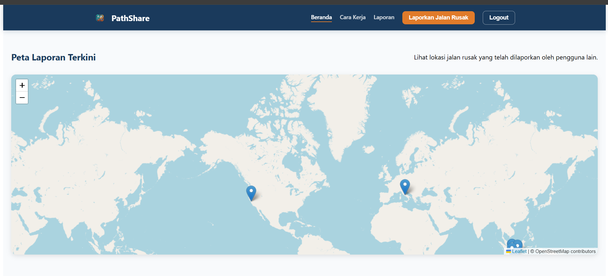
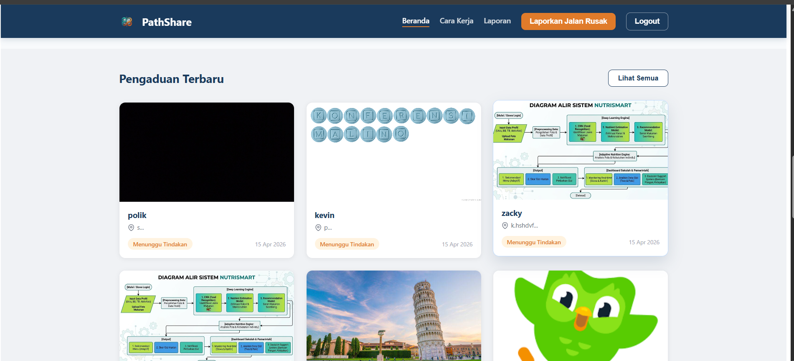
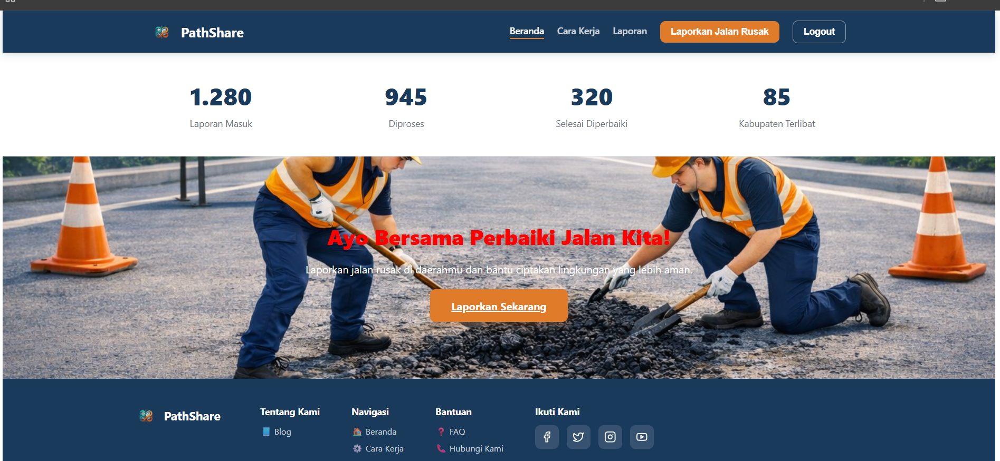
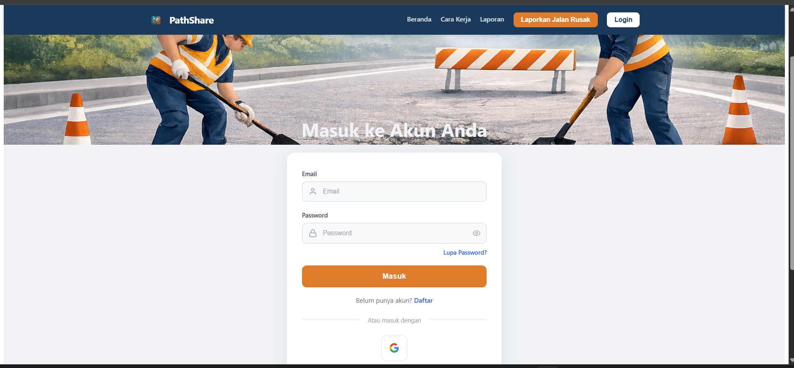
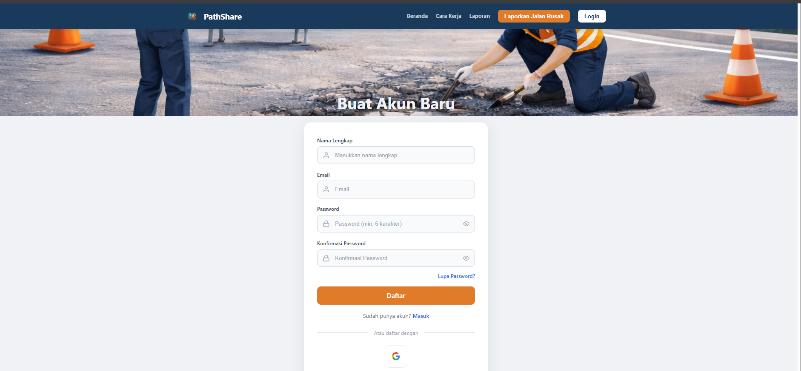
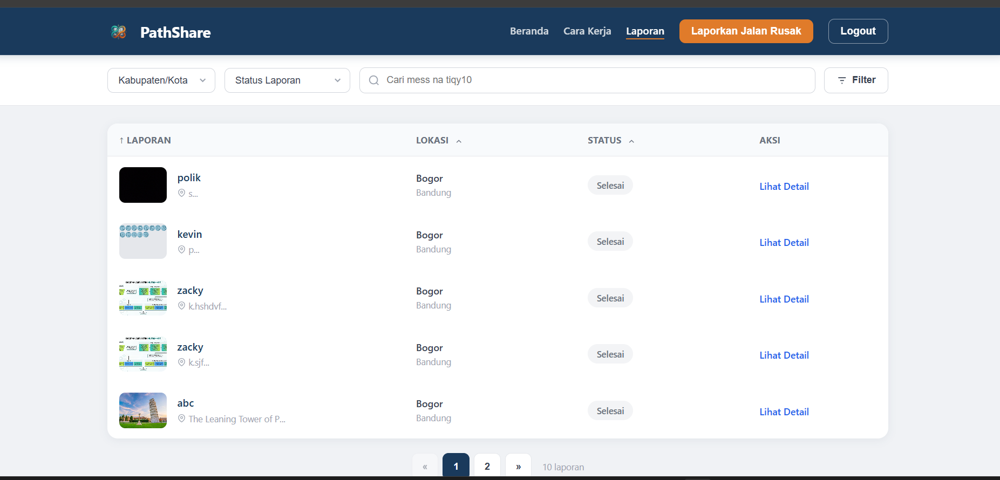
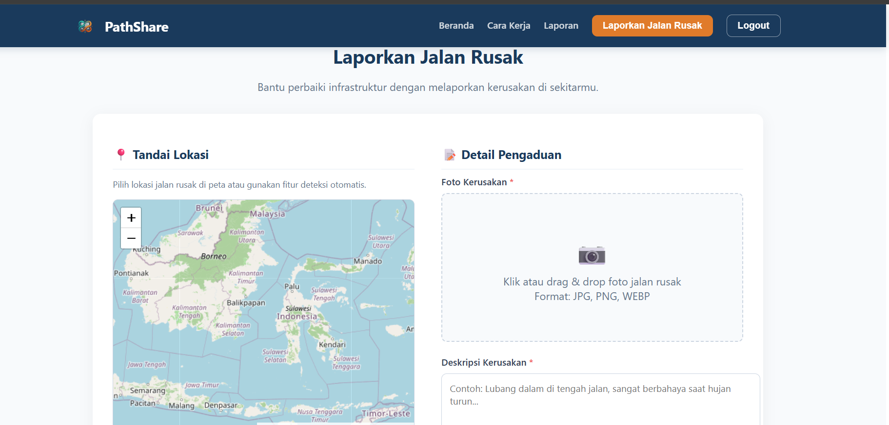
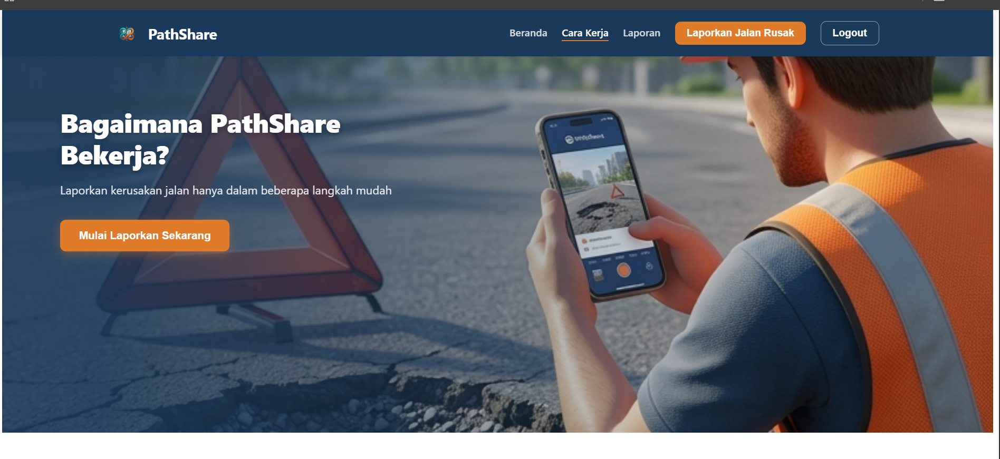
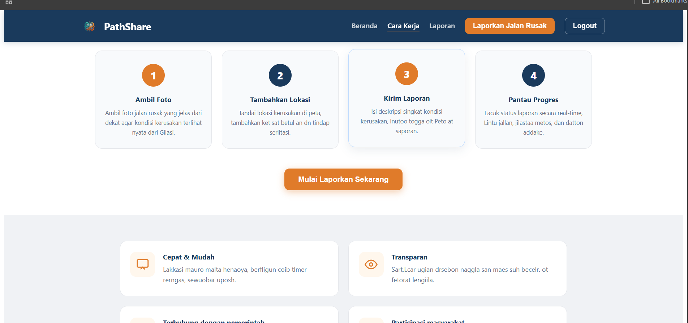

# 🛣️ PathShare

> **A modern Progressive Web App for reporting damaged roads in Indonesia.**  
> Built with Vue 3, Vite, and Service Workers — featuring offline support, push notifications, and real-time reporting.


---

## 📖 Description

PathShare is a community-driven platform where citizens can report damaged roads, potholes, and broken infrastructure in their area. Reports are submitted with photos, descriptions, and GPS coordinates — and can be tracked in real-time through status updates.

The app works fully offline, supports push notifications, and is installable as a PWA on any device.

---

## ✨ Features

- 🔐 **Authentication** — Email/password login & Google Sign-In via OAuth
- 📸 **Create Report** — Upload photo, add description & GPS location
- 🗺️ **Interactive Map** — View all reports on a Leaflet.js map
- 📋 **Report List** — Browse, filter, and search all submitted reports
- 🔔 **Push Notification** — Browser push notifications via Service Worker
- 🔄 **Background Sync** — Pending reports sync automatically when back online
- 📶 **Offline Support** — Full offline experience using Workbox caching strategies
- 📱 **Responsive UI** — Mobile-first design, installable as PWA

---

## 🛠️ Tech Stack

| Category             | Technology                |
| -------------------- | ------------------------- |
| Framework            | Vue 3 (Composition API)   |
| Build Tool           | Vite                      |
| Routing              | Vue Router                |
| State Management     | Pinia                     |
| PWA / Service Worker | Workbox (vite-plugin-pwa) |
| Map                  | Leaflet.js                |
| API                  | Dicoding Story API        |
| Auth                 | Google OAuth 2.0          |
| Storage              | IndexedDB (via idb)       |

---

## 📸 Screenshots

### 🏠 Home Page






### 🔐 Authentication

| Login                            | Register                               |
| -------------------------------- | -------------------------------------- |
|  |  |

### 📋 Laporan & Detail

| Laporan                              | Create Story                            |
| ------------------------------------ | --------------------------------------- |
|  |  |

### ⚙️ Cara Kerja




---

## 🚀 Installation

### Prerequisites

- Node.js `>= 18.x`
- npm `>= 9.x`

### Steps

```bash
# 1. Clone the repository
git clone https://github.com/yourusername/pathshare.git
cd pathshare

# 2. Install dependencies
npm install

# 3. Start development server
npm run dev

# 4. Build for production
npm run build

# 5. Preview production build (required for PWA & Service Worker)
npm run preview
```

> ⚠️ **Service Worker only activates in `npm run preview` or production build.** Use `npm run preview` to test PWA features (offline, notifications, background sync).

---

## 🔧 Usage

### Login

1. Open the app and click **Login**
2. Sign in with your email & password, or click **Sign in with Google**

### Create a Report

1. Click **Laporkan Jalan Rusak** in the navbar
2. Upload a photo of the damaged road
3. Write a description of the damage
4. Allow location access or enter coordinates manually
5. Click **Kirim Laporan**

### Enable Notifications

1. Go to the Home page
2. Find the **Notification Panel**
3. Click **Aktifkan Notifikasi** and allow permission in browser

### View Reports

- Browse all reports at `/laporan`
- Filter by city, status, or search by keyword
- Click **Lihat Detail** to see full report with map

---

## 📁 Project Structure

```
pathshare/
├── public/
│   ├── asset/                  # Static images (hero, CTA, footer)
│   ├── icons/                  # PWA icons
│   └── screenshot/             # App screenshots
│
├── src/
│   ├── api/
│   │   └── storyApi.js         # API call functions
│   │
│   ├── auth/
│   │   └── googleAuth.js       # Google OAuth integration
│   │
│   ├── components/
│   │   ├── MapView.vue         # Leaflet map component
│   │   ├── NotificationPanel.vue # Push notification UI
│   │   └── StoryCard.vue       # Report card component
│   │
│   ├── notifications/
│   │   └── push.js             # Push subscribe / local notification
│   │
│   ├── router/
│   │   └── index.js            # Vue Router config + auth guards
│   │
│   ├── services/
│   │   └── db.js               # IndexedDB (offline storage)
│   │
│   ├── store/
│   │   └── module/
│   │       ├── auth.js         # Auth state (Pinia)
│   │       ├── index.js        # Store entry
│   │       └── storyStore.js   # Story state (Pinia)
│   │
│   ├── sw/
│   │   └── custom-sw.js        # Custom Service Worker (Workbox)
│   │
│   ├── sync/
│   │   └── backgroundSync.js   # Background sync logic
│   │
│   ├── utils/
│   │   └── cache-strategies.js # Cache strategy helpers
│   │
│   ├── views/
│   │   ├── BlogView.vue
│   │   ├── CaraKerjaView.vue
│   │   ├── ContactView.vue
│   │   ├── CreateStoryView.vue
│   │   ├── DetailView.vue
│   │   ├── FAQView.vue
│   │   ├── HomeView.vue
│   │   ├── LaporanView.vue
│   │   ├── LoginView.vue
│   │   ├── NotFoundView.vue
│   │   └── RegisterView.vue
│   │
│   ├── api-endpoint.js         # Base URL config
│   ├── App.vue                 # Root component + navbar + footer
│   └── main.js                 # App entry point
│
├── index.html
├── vite.config.js
├── package.json
└── README.md
```

---

## 🌐 API Integration

**Base URL:** `https://story-api.dicoding.dev/v1`

| Endpoint       | Method | Description                  |
| -------------- | ------ | ---------------------------- |
| `/register`    | POST   | Register new user            |
| `/login`       | POST   | Login and get token          |
| `/stories`     | GET    | Fetch all stories            |
| `/stories`     | POST   | Create new story (multipart) |
| `/stories/:id` | GET    | Get story detail             |

### Authentication

All protected endpoints require a Bearer token in the Authorization header:

```
Authorization: Bearer <token>
```

Token is stored in `localStorage` under the key `pathshare_auth`.

---

## 📶 PWA Features

### 🗂️ Offline Caching (Workbox)

| Cache Name         | Strategy               | Description                       |
| ------------------ | ---------------------- | --------------------------------- |
| `workbox-precache` | Precache               | JS, CSS, HTML assets              |
| `api-cache-v1`     | Network First          | API responses (fallback to cache) |
| `image-cache-v1`   | Cache First            | Story photos (30 days)            |
| `static-assets-v1` | Stale While Revalidate | Fonts, scripts                    |

### 🔔 Push Notification

- Requests browser permission via `Notification.requestPermission()`
- Local notifications triggered via Service Worker registration
- Supports VAPID-based push (backend required for server-push)
- Click action navigates to the relevant report

### 🔄 Background Sync

- Registers a sync event (`sync-new-story`) when offline
- Service Worker listens for the `sync` event
- Pending reports stored in IndexedDB are sent when connection is restored

---

## 👤 Author

**Your Name**

🔗 [LinkedIn](https://www.linkedin.com/in/rangga-utama-6bb76b362/)  
🐙 [GitHub](https://github.com/ranggautama47)

---

## 📄 License

This project is licensed under the [MIT License](./LICENSE).

---

<p align="center">
  Made with ❤️ for better Indonesian roads
</p>
